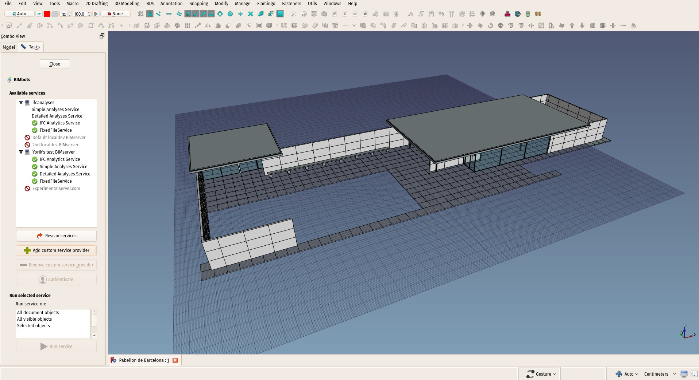

# BIMbots-FreeCAD




A FreeCAD plugin to communicate with BIMbots services - http://bimbots.org/

This plugin is written in Python, it consists of a single all-in-one file. It can be used in several ways. The main usage is to work inside [FreeCAD](http://www.freecadweb.org), as a macro. If launched as a macro or imported from the FreeCAD python console, the plugin will show a full GUI panel that allows to run different BIMbots services.

The plugin can also be run directly from the terminal, in which case it prints a list of services it was able to reach, or imported as a python module (Python 2 and Python 3 compatible), in which case you have access to several utility functions to retrieve an communicate with BIMbots services, so this can also be used as a library to build your own BIMBots client.

Check the [API documentation](doc/documentation.md) page (autogenerated with [pdoc](https://pdoc3.github.io/pdoc/)) and the [FreeCAD GUI documentation](doc/ui-documentation.md).

#### When used as a Python module, it can:

* Retrive a list of BIMbots services
* Authenticate with any of the services
* Keep authentication credentials in a config file
* Test services (send a minimal test IFC file that is guaranteed to work)
* Send actual IFC files
* Get the results

#### When running inside FreeCAD:

* All functionality is available from the GUI
* Auto-discover available services
* Add/remove custom servers
* Authenticate with services
* Send model data to any service
* Display JSON or text reports
* Double-click results (JSON results only) to select corresponding objects in the 3D view

#### To do:

* Handle Context-Id (reuse an already sent model slot)
* Handle asynchronous connection (don't wait and freeze the FreeCAD interface while data is being transmitted)
* Save the config file to something better than ~/.bimbots on windows
* Add this plugin to the FreeCAD addons manager

#### Extended goal:

* Implement display of BCF files in FreeCAD

#### How to test

##### From the command line or terminal:

`> bimbots.py`

This prints basic available services information (both auto-discovered and manually added via the FreeCAD UI):

```
Available services:
Service Simple Analyses Service from ifcanalyses - not authenticated
Service Detailed Analyses Service from ifcanalyses - not authenticated
Service IFC Analytics Service from ifcanalyses - not authenticated
Service FixedFileService from ifcanalyses - not authenticateds
Service IFC Analytics Service from Yorik's test BIMserver - authenticated as http://localhost:8082/servicelist , service 2097206
Service Simple Analyses Service from Yorik's test BIMserver - not authenticateds
Service Detailed Analyses Service from Yorik's test BIMserver - not authenticated
```

##### From Python:

```
>>> import bimbots
>>> bimbots.get_service_providers()
```

This returns a dictionary containing the different service providers found (both auto-discovered and manually added via the FreeCAD UI):

```
[{u'listUrl': u'https://ifcanalysis.bimserver.services/servicelist', u'name': u'ifcanalyses'}, {u'listUrl': u'http://localhost:8080/servicelist', u'name': u'Default localdev BIMserver', u'description': u'Default localdev BIMserver'}, {u'listUrl': u'http://localhost:8081/servicelist', u'name': u'2nd localdev BIMserver', u'description': u'2nd localdev BIMserver'}, {u'listUrl': u'http://localhost:8082/servicelist', u'name': u'Default JAR runner', u'description': u'Default JAR runner'}, {u'listUrl': u'https://thisisanexperimentalserver.com/servicelist', u'name': u'Experimentalserver.com', u'description': u'Experimental BIMserver'}]
```

`>>> bimbots.get_services('http://localhost:8082/servicelist')`

This returns a list of services offered by the given server (adding the /servicelist is optional):

```
[{u'inputs': [u'IFC_STEP_2X3TC1'], u'resourceUrl': u'http://localhost:8082/services', u'description': u'IFC Analytics Service', u'outputs': [u'IFC_ANALYTICS_JSON_1_0'], u'providerIcon': u'/img/bimserver.png', u'provider': u"Yorik's test BIMserver", u'oauth': {u'tokenUrl': u'http://localhost:8082/oauth/access', u'registerUrl': u'http://localhost:8082/oauth/register', u'authorizationUrl': u'http://localhost:8082/oauth/authorize'}, u'id': 2097206, u'name': u'IFC Analytics Service'}, {u'inputs': [u'IFC_STEP_2X3TC1'], u'resourceUrl': u'http://localhost:8082/services', u'description': u'BIMserver plugin that provides an analysis of a model and and outputs it into json', u'outputs': [u'UNSTRUCTURED_UTF8_TEXT_1_0'], u'providerIcon': u'/img/bimserver.png', u'provider': u"Yorik's test BIMserver", u'oauth': {u'tokenUrl': u'http://localhost:8082/oauth/access', u'registerUrl': u'http://localhost:8082/oauth/register', u'authorizationUrl': u'http://localhost:8082/oauth/authorize'}, u'id': 2162742, u'name': u'Simple Analyses Service'}, {u'inputs': [u'IFC_STEP_2X3TC1'], u'resourceUrl': u'http://localhost:8082/services', u'description': u'BIMserver plugin that provides a detailed analysis of a model and outputs it into json', u'outputs': [u'UNSTRUCTURED_UTF8_TEXT_1_0'], u'providerIcon': u'/img/bimserver.png', u'provider': u"Yorik's test BIMserver", u'oauth': {u'tokenUrl': u'http://localhost:8082/oauth/access', u'registerUrl': u'http://localhost:8082/oauth/register', u'authorizationUrl': u'http://localhost:8082/oauth/authorize'}, u'id': 2228278, u'name': u'Detailed Analyses Service'}]
```

There are more functions to interact with services. Check the [API documentation](doc/documentation.md) for the full list of available functions.

##### From FreeCAD

This plugin is meant to be easily installable via FreeCAD's Add-ons manager. While this isn't done, however, you need to install it manually by copying this repository to the FreeCAD Mod folder, and run it via the FreeCAD Python console (found under menu **View->Panels** in FreeCAD):

* Download this plugin by pressing the green "Clone or download" button on top of the [Github repository page](https://github.com/opensourceBIM/BIMbots-FreeCAD) and selecting "Download ZIP"
* Unzip the downloaded file. It will contain a "BIMbots-FreeCAD-master" folder. Rename it if you wish.
* Move the "BIMBots-FreeCAD-master" folder inside your FreeCAD Mod directory. The location of your FreeCAD Mod directory  is given when entering `App.getUserAppDataDir()+"Mod"` in the FreeCAD Python console. You might need to create a "Mod" subdirectory there, if not present.
* Restart FreeCAD if already running
* In the FreeCAD Python console, type: 
```
import bimbots
bimbots.launch_ui()
```
* If you know your way with Git, you can also simply clone this repo inside the FreeCAD Mod directory.
* If you have the **BIM Workbench** installed (via the FreeCAD add-ons manager, found under menu Tools), and the BIMBots is installed in the Mod directory as explained above, the BIM workbench auto-destects it and you will have a BIMBots entry found under menu Utils, to lauch the plugin.
